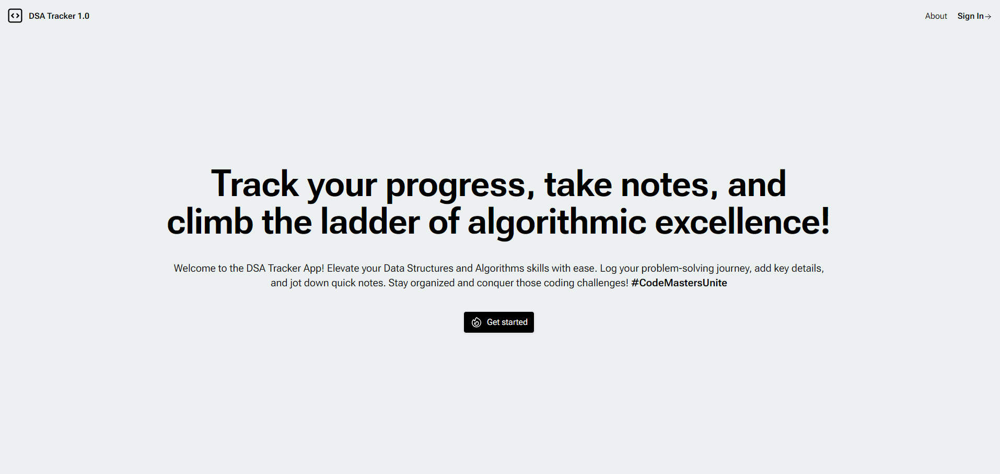
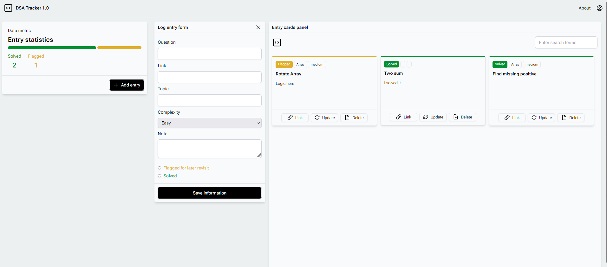
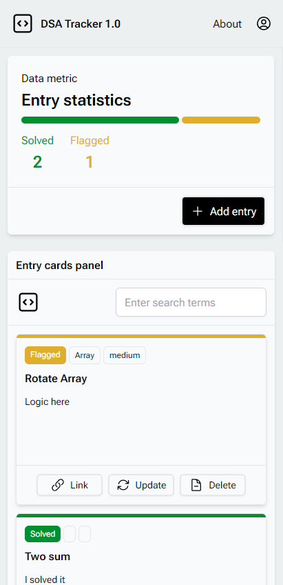

# DSA-Tracker 1.0

    

        

            
        

        

            
        

    

<!--    

        
    
 -->

DSA-Tracker 1.0 is a Full Stack web application designed to help users efficiently manage their Data Structures and Algorithms (DSA) study progress. This application provides a user-friendly interface for logging, updating, and deleting study entries, as well as tracking the status and complexity of each question.

### App URL : https://app-dsa-tracker.netlify.app/

## Features

### 1. Logging Entries

Users can log their study sessions, providing valuable information about the questions they worked on.

### 2. Detailed Entry Information

Each entry can include:

- **Questions:** List of questions studied.
- **Link:** Reference link.
- **Topics:** Relevant DSA topics associated with the questions.
- **Complexity:** Complexity level of the questions.
- **Notes:** Any notes regarding question.
- **Status:** Current status of the study session (e.g., In Solved, Flagged for later view).

### 3. Update and Delete Entries

Users have the flexibility to update and delete entries, allowing them to maintain an accurate and up-to-date study log.

### 4. Open Links

Users can attach links to questions, providing direct access to online resources or references related to the study material.

### 5. Search Functionality

Efficient search functionality allows users to quickly find specific entries, questions, or topics within their study log.

### 6. Summary Card

A summary card on the main screen displays counts of solved and flagged questions, providing users with a quick overview of their study progress.

### 7. Responsive Design

DSA-Tracker 1.0 is fully responsive, ensuring a seamless user experience across various screen sizes and devices.

### Highlighting Features

#### JWT Authentication

- Secure user authentication using JSON Web Tokens (JWT).
- Protects routes and ensures that only authenticated users can access certain functionalities.

#### Route Guard

- Implements route guards to control access to specific routes based on user authentication status.

#### OTP Generation for password reset

- Generated OTP and store in MongoDB.
- Created MongoDB schema which expires OTP after certain second ( Using TTL Schema)
- Mail trigger using Gmail STMP server, using authentication user and app password

#### Express and Express Router

- Utilizes the Express.js framework for building the backend API.
- Organizes routes using Express Router for a modular and maintainable code structure.

#### Environment Level .env Files Management

- Safely manages environment-specific configurations using the dotenv package.
- Allows easy configuration of environment variables like database connection strings and secret keys.

## Technology Stack

DSA-Tracker 1.0 is built using the MERN stack:

- **MongoDB:** Database for storing study entries and related information.
- **Express.js:** Backend framework for handling API requests and routing.
- **React.js:** Frontend library for building the user interface.
- **Node.js:** JavaScript runtime for server-side development.

## Getting Started

To get started with DSA-Tracker 1.0, follow these steps:

1. Clone the repository.
2. Navigate to the project directory.
3. Install dependencies using `npm install`.
4. Start the application using `npm start`.

## Contributions

Contributions are welcome! If you have any suggestions, enhancements, or bug fixes, feel free to create issues or pull requests.
